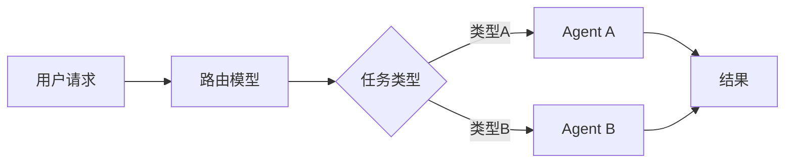
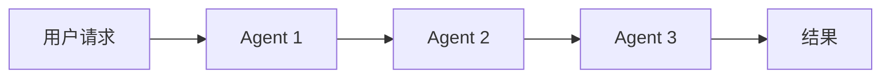
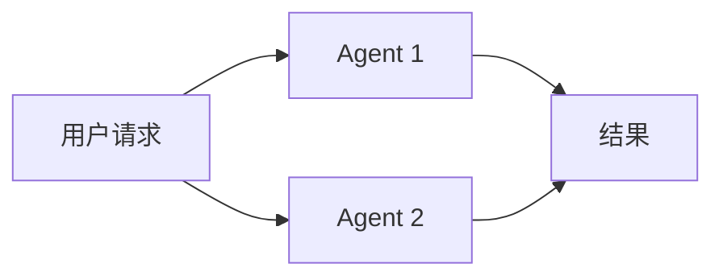

随着模型在工具调用能力上的提升，Agent也成为当前最热门的方向之一。本文结合个人的实践，分享一些Agent构建的心得及避坑经验。

# 一、选择合适的模型

截止2025年9月，市面上已经有多款支持长上下文和工具调用能力的开源大模型，闭源的有GPT-5 Cluade-Sonnet-4等，开源的有Qwen3、Kimi-K2 Deepseek-V3.1等。那么如何选择合适的模型呢？这里有几个建议：

<!--more-->

## 慎用Reasoning模型

可能大家会觉得很奇怪，明明推理模型能力更强，为什么不建议使用呢？目前的推理模型的能力强主要体现在数学推理、逻辑推理。对于需要多步执行的Agent任务，推理模型并不一定表现更好。而不推荐用推理模型也主要有以下几个原因：
1. 推理模型容易陷入过度思考，而Agent更多需要使用工具获取更多上下文，从而决定下一步的行动。如果模型过度思考，反而会忽略使用工具去获取外部知识。
2. 推理模型延迟高，推理模型需要思考token，导致每次调用的延迟较高，而Agent通常需要多次调用模型，延迟高会严重影响用户体验，并导致任务运行时间过长。

## 模型推荐

所以比较推荐非思考模型如kimi-k2、claude-sonnet-4-no-thinking等，当然混合推理模型也可以考虑，比如glm4.5。如果不考虑成本，当前最好的Agent模型依然是Claude。

# 二、Prompt撰写：由简入繁

Prompt的撰写是Agent构建中非常重要的一环，好的Prompt可以大幅提升Agent的性能。提示词应该保持简单明了，原因在于：
1. 随着模型的能力越来越强，提示词工程也越来越弱化，很多时候只需要简单的指令即可完成复杂的任务。
2. 复杂的提示词容易导致模型理解偏差，反而影响性能。比如过于详细复杂的步骤描述，对于需要灵活应对多变场景的Agent来说，反而不利于发挥模型的能力。
3. 过长的提示词会占用大量上下文，推理延迟高。

所以建议从简单的提示词开始，逐步增加复杂度，观察Agent效果，继续调整。

## 提示词模板

这里也提供一个常用的Prompt模板，供大家参考：

```
<role>
角色定义
</role>

<task>
任务描述
</task>

<tools>
工具使用说明
</tools>

<output_format>
输出格式定义
</output_format>

<note>
注意事项
</note>
```

## 少用fewshot和manyshot

当前大模型的能力已经非常强，对于大部分任务，fewshot和manyshot并不能带来显著提升，反而会占用大量上下文，增加推理延迟。所以建议少用fewshot和manyshot，更多依赖模型的理解能力。只有在测试过程中发现，模型对某些任务表现不佳时，才考虑加入fewshot。

## 多参考官方提示词技巧

大模型厂商通常会提供一些官方的提示词技巧和示例，建议多参考这些资源，结合自己的任务进行调整。比如[OpenAI](https://cookbook.openai.com/examples/gpt-5/gpt-5_prompting_guide)、[Anthropic](https://docs.anthropic.com/en/docs/build-with-claude/prompt-engineering/overview)等都提供了丰富的提示词资源。

比如Anthropic关于Claude 4的工具并行调用的提示词：
```
For maximum efficiency, whenever you need to perform multiple independent operations, invoke all relevant tools simultaneously rather than sequentially.
```

# 三、工具设计

Agent的核心在于工具的设计，工具设计的好坏直接影响Agent的性能。工具大致可以分为三类：
1. 提供相关上下文的工具：如搜索引擎、知识库，数据库查询等，
1. 执行类工具：如计算器、代码执行环境等，
2. 任务类工具：如规划工具，思考工具等。

## 错误信息是非常重要的上下文

很多人在设计Agent时，有几个错觉：
1. 希望Agent能够完美地使用工具，不能出现明显的错误，
2. 不断的添加提示词，告诉模型如何正确使用工具。

特别是第二点，有时候无论如何添加提示词，模型依然会犯错。其实是大家忽略了工具的错误处理。实际上，工具在实际使用中，难免会出现各种错误，比如网络异常、数据异常等。所以在设计工具时，一定要明确工具的错误处理机制。比如生成sql查询时，可能会出现语法错误，工具需要能够捕获这些错误，并返回给Agent，从而Agent能够不断调整语法，直到正确为止。

还有一部分人在使用API调用外部服务的工具时，会直接返回错误码，不告诉模型具体的错误信息。从而导致模型无法正确处理错误，无法根据错误信息进行调整。

## 使用规划类工具的时机

对于Manus和Claude Code等产品都内置了规划类（TODO）工具，以帮助Agent更好地组织任务。规划类工具确实可以帮助Agent更好地组织任务，提升准确率。但是并不是所有场景都适合使用规划类工具。一般来说，以下几种情况适合使用规划类工具：
1. 任务复杂，包含多个子任务，需要有序执行，
2. 任务步骤明确，可以预先规划好执行顺序，

而对于那些步骤不明确，或者需要灵活应对的任务，规划类工具反而会增加复杂度，影响性能。原因在于：
1. 不明确的任务，对于人来说，也无法一次性规划好所有步骤，模型也一样。
2. 如果生成了规划，模型会过度依赖之前的规划路径来执行，而对于灵活应对的任务，需要根据工具返回结果决定下一步的行动，规划反而会限制模型的灵活性。让模型归于僵化。

所以建议在使用规划类工具时，先评估任务的复杂度和明确度，选择合适的场景使用。对于那些不适合使用规划类工具的任务，可以考虑添加更新任务的工具，帮助模型动态调整任务。但是从实际经验来看，模型不会倾向于使用更新任务的工具，反而会继续执行之前的任务。

> 有时使用模型的内在规划能力，反而效果更好。

# 四、多Agent协作

多Agent协作是当前比较热门的方向，多个Agent可以协同工作，完成复杂任务。多Agent协作有以下几种模式：

1. 路由模式：使用一个路由模型，根据任务类型，选择合适的Agent来处理任务


2. 流水线模式：多个Agent按顺序处理任务，每个Agent负责一个子任务


3. 协同模式：多个Agent同时处理任务，互相协作完成任务


## 多Agent优势
1. 专业化：每个Agent可以专注于某一领域，提升专业能力
2. 可扩展性：可以方便地添加新的Agent，扩展系统能力
3. 上下文管理：每个Agent可以有独立的上下文，避免单个Agent上下文过长

## 什么时候使用多Agent

其实我也看到不少文章批评多Agent架构，认为其复杂度过高，调试困难，性能不如单Agent。多Agent确实不适合所有场景，但是对于一些场景，多Agent架构确实有其优势。比如：
1. 任务复杂但职责明确，比如需要查询和分析多个不同产品的日志，如果使用单个Agent，会导致提示词非常复杂，且容易混淆模型，导致出错；当使用多Agent时，可以让每个Agent专注于某一产品的日志查询和分析，提升准确率。
2. 任务上下文长，还是以日志分析为例，一般日志量非常大，如果将日志查询的结果全部放入单个Agent，会导致上下文过程，导致模型性能下降，甚至无法处理。

> 个人认为，未来多Agent并行协作依然会成为主流。

# 五、调试与监控

Agent的调试和监控是非常重要的环节，好的调试和监控可以帮助我们快速定位问题，提升系统稳定性。这里有几个建议：
1. 日志记录：详细记录每次Agent的调用，包括输入、输出、工具调用等，方便后续分析
2. 性能监控：监控Agent的响应时间、错误率等指标，及时发现问题
3. 自动化测试：为Agent设计自动化测试用例，确保每次更新不会引入新的问题
4. 用户反馈：收集用户反馈，了解Agent在实际使用中的表现，持续优化

# 六、总结

Agent构建是一个复杂但有趣的过程，涉及模型选择、Prompt撰写、工具设计、多Agent协作以及调试与监控等多个环节。当然以个人的经验可能并不全面，希望本文的分享能够帮助大家更好地理解和构建Agent系统，避免一些常见的坑。

# 七、展望
可以想象，未来随着大模型能力的提升，算力的提升，一个Agent可以在几分钟，甚至几秒内就完成一个碳基生物需要几个小时甚至几天才能完成的任务。而且Agent可以复制，可以并行执行，可以无时无刻不在工作。未来的Agent可能会彻底改变我们的工作和生活方式。这是一件令人兴奋同时又令人恐惧的事情。

希望大家都能在这个过程中，找到合适自己的兴趣，共同迎接这个充满挑战和机遇的时代。